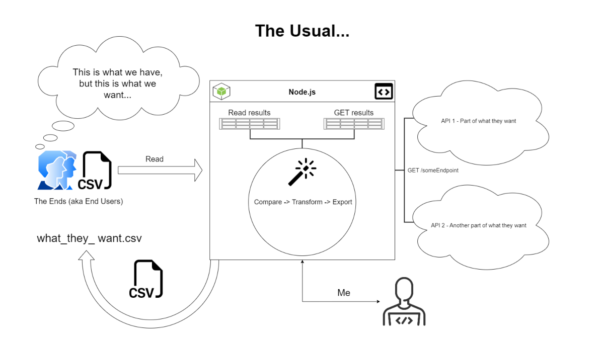

# Automating my work life

This repo is a collection of lengthy, repetitive, and ultimately unsatisfying tasks from work I have automated out of my life forever! I enjoy learning about technology that can make my life easier, and sharing it with others to make their lives easier.

> I chose a lazy person to do a hard job. Because a lazy person will find an easy way to do it.

— Bill Gates

## The Usual

If my work life was a story, every chapter would start off something like this...

> I did not realize these things had these properties! I wonder how many of these things exist with this, that, or the other thing? If I give you a list of the things I care about, can you do a "search" and give me a list of things that have the properties I am looking for?

— Ends (aka End Users)



## Requirements

1. [.env file](https://github.com/motdotla/dotenv) - I am using a local .env file to access sensitive info like API urls

2. [Vault](https://developer.hashicorp.com/vault/downloads) - I am using the Vault CLI to access secrets for API calls ([example](https://github.com/mshuber1981/work-life/blob/main/present/functions/Auth.js#L12))

3. [Google Cloud](https://cloud.google.com/sdk/docs/install#mac) - I am using the gcloud CLI to authenticate and access BigQuery

   [gcloud CLI - Authorize with a user account](https://cloud.google.com/sdk/docs/authorizing#authorize_with_a_user_account)

   ```bash
   gcloud auth application-default login
   ```

4. [:page_facing_up: MkDocs](https://www.mkdocs.org/) :point_down:

### Getting started with MkDocs

1. Requirements - [https://www.mkdocs.org/user-guide/installation/#requirements](https://www.mkdocs.org/user-guide/installation/#requirements)
2. Installing MkDocs - [https://www.mkdocs.org/user-guide/installation/#installing-mkdocs](https://www.mkdocs.org/user-guide/installation/#installing-mkdocs)
3. Themes (material) - [https://github.com/squidfunk/mkdocs-material#quick-start](https://github.com/squidfunk/mkdocs-material#quick-start)
4. Formatting options (markdown_extensions) - [https://www.mkdocs.org/user-guide/configuration/#formatting-options](https://www.mkdocs.org/user-guide/configuration/#formatting-options)
5. Run the builtin development server - [https://www.mkdocs.org/user-guide/cli/#mkdocs-serve](https://www.mkdocs.org/user-guide/cli/#mkdocs-serve)
6. Deployment options - [https://www.mkdocs.org/user-guide/deploying-your-docs/](https://www.mkdocs.org/user-guide/deploying-your-docs/)
