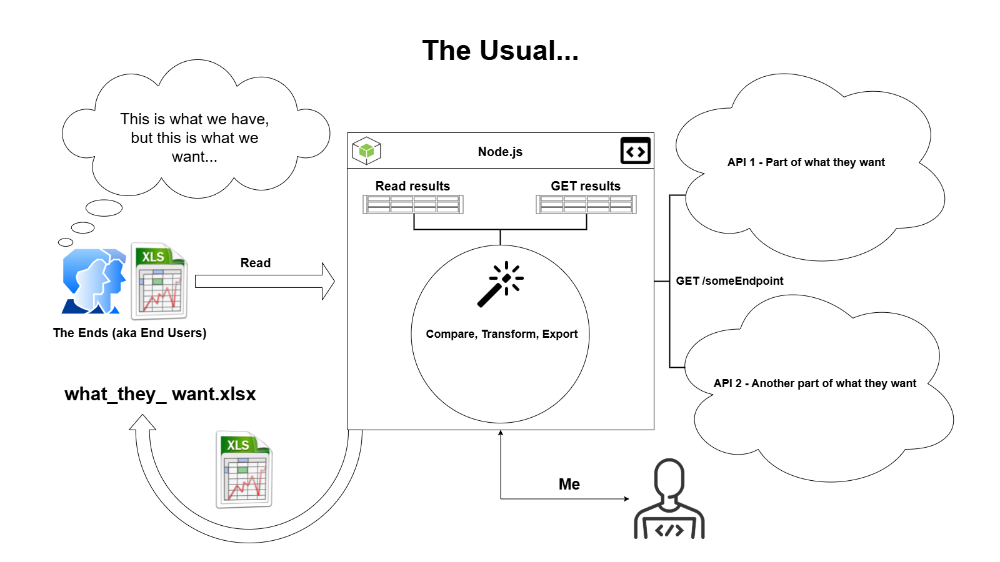

# Automating my work life

> I chose a lazy person to do a hard job. Because a lazy person will find an easy way to do it.

— Bill Gates

## The Usual

This site contains generic examples of things I have learned about and use at work. If my work life was a story, every chapter would start with something like this...

> I did not realize these things had these properties! I wonder how many of these things exist with this, that, or the other thing? If I give you a list of the things I care about, can you do a "search" and give me a list of things that have the properties I am looking for?

— Ends (aka End Users)



## Requirements

1. [Vault](https://developer.hashicorp.com/vault/downloads) - I am using the vault CLI to access secrets at work for API calls ([vaultOAuthToken.mjs line 15](https://github.com/mshuber1981/work-life/blob/main/src/utils/vaultOAuthToken.mjs#L15)), but this is not required to use the generic GitHub API and Google BigQuery examples.

2. [Google Cloud](https://cloud.google.com/sdk/docs/install#deb) - I am using the gcloud CLI to authenticate and access BigQuery.

   [gcloud CLI - Authorize with a user account](https://cloud.google.com/sdk/docs/authorizing#authorize_with_a_user_account)

   ```bash
   gcloud auth application-default login
   ```

### Tests

```bash
npm run test
```

```bash
 PASS  test/requirements.test.js
 PASS  test/general.test.js

Test Suites: 2 passed, 2 total
Tests:       11 passed, 11 total
Snapshots:   0 total
Time:        1.411 s, estimated 2 s
Ran all test suites.
```

## CLI examples

```bash
npm run start
```


## Getting started with MkDocs

1. Requirements - [https://www.mkdocs.org/user-guide/installation/#requirements](https://www.mkdocs.org/user-guide/installation/#requirements)
2. Installing MkDocs - [https://www.mkdocs.org/user-guide/installation/#installing-mkdocs](https://www.mkdocs.org/user-guide/installation/#installing-mkdocs)
3. Themes (material) - [https://github.com/squidfunk/mkdocs-material#quick-start](https://github.com/squidfunk/mkdocs-material#quick-start)
4. Formatting options (markdown_extensions) - [https://www.mkdocs.org/user-guide/configuration/#formatting-options](https://www.mkdocs.org/user-guide/configuration/#formatting-options)
5. Run the built-in development server - [https://www.mkdocs.org/user-guide/cli/#mkdocs-serve](https://www.mkdocs.org/user-guide/cli/#mkdocs-serve)
6. Deployment options - [https://www.mkdocs.org/user-guide/deploying-your-docs/](https://www.mkdocs.org/user-guide/deploying-your-docs/)
